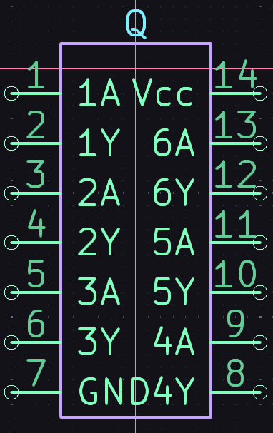
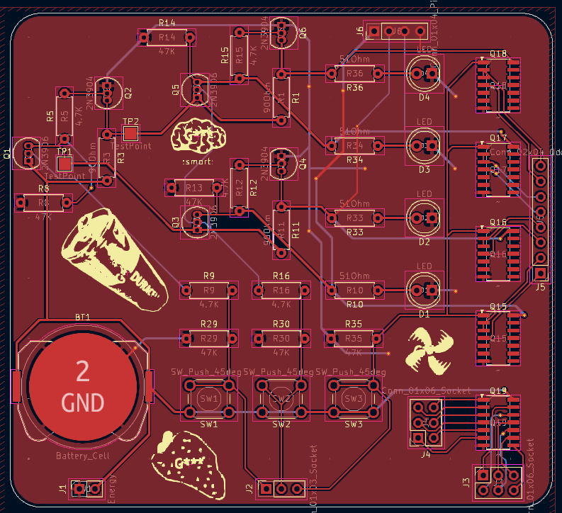
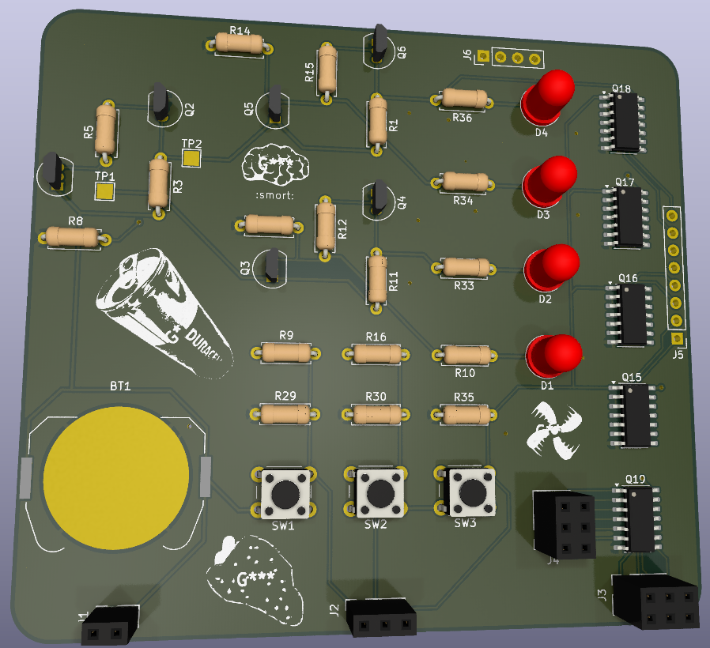

## Function
This is a PCB that converts a binary number input into a single logic high line on the output. It can be used to drive a stepper motor with less MCU pins.
## Images
### Schematic

The schematic has an unpopulated section of an additional layer. Since the solder kit doesn't have this many transistors and I lacked PCB space, I decided to use hex inverter ICs (which I can get for cheap) for the same inverter->inverter function.

I decided to make my own symbol for the IC (according to the datasheets) so that I don't mess up the wiring:

## PCB

The PCB has a lot of broken out pins for the single-line output. It also has LEDs for easier testing, and footprints for the ICs I will buy myself.
## 3D render

